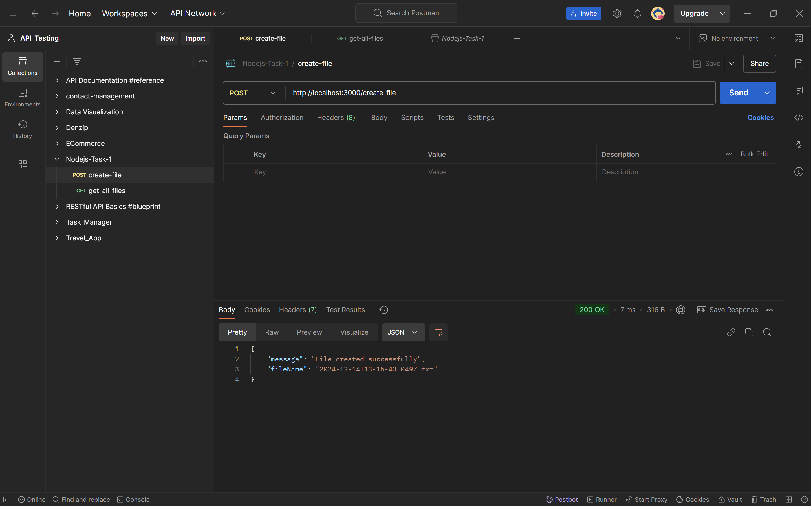
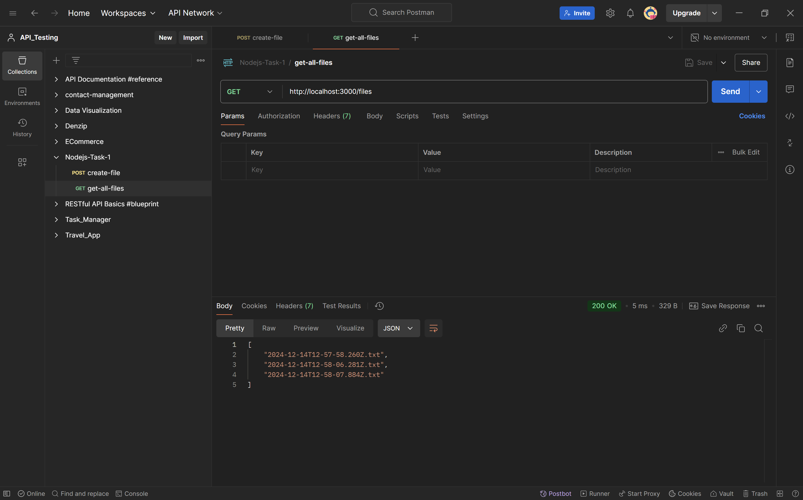

# Node.js File System

This project is a simple Node.js application that provides APIs to create and retrieve text files.

---

## Features
- *Create a File*: An API endpoint to create a .txt file with the current timestamp as its content.
- *Retrieve Files*: An API endpoint to list all .txt files in the directory.

---

## API Endpoints

### 1. Create a File
- *Endpoint*: POST /create-file
- *Description*: Creates a new text file with the current timestamp.
- *Example (Postman)*:
  

---

### 2. Get All Files
- *Endpoint*: GET /files
- *Description*: Retrieves all .txt files in the files/ directory.
- *Example (Postman)*:
  

---

## Deployment
 - The project is deployed on Render.
https://priya-dharshini-nodejs-filesystem.onrender.com